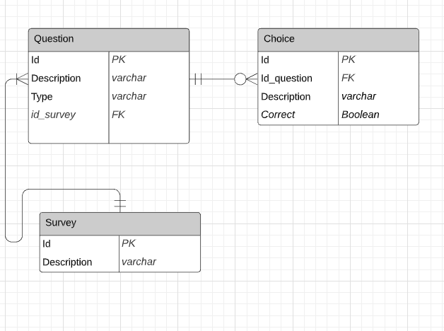

# Api Rest para la gestion de encuesta.

Esta api rest permite el registro y consulta de encuestas, esta contruida bajo arquitetura limpia.

## Estructura:
* **Applications:** Esta capa se encarga de arrancar la aplicacíon y ademas en el se encuentran configuraciones generales del api. En el se encuentra el siguiente modulo:
  * **restaurant-service**: Este modulo se encarga de arrancar la aplicacíon y ejecutar los bean que usaran de forma general en la aplicacion.

* **Domain:** Es el nucleo de la aplicacion y en esta se encuetran las entidades core de negocio y los casos de uso. En esta capa se encuentran los siguientes modulos:
    * **Model**: En este modulo se encuentran las entidades core del negocio.
    * **Use Case** En este modulo se encuentran los casos de uso.

* **infrastructure:** En esta capa se encuentran los componentes de entrada y salida como adaptadores y punto de entrada de la aplicacion y esta compuesta por los siguientes modulos:
    * **driven-adapters.persistence:** Este modulo se encarga de interactuar con la base de ddatos.
    * **entry-points.web-restaurant:** Este modulo es el punto de entrada de la aplicaccion, es donde se encuentran los controladores y endpoints. 

## Configuracion: 

* **Java Version**: Esta aplicacion esta desarrollada bajo la version 11 de Java.

## Swagger
http://localhost:8080/restaurant/swagger-ui/index.html

## Diagrama de entidades

